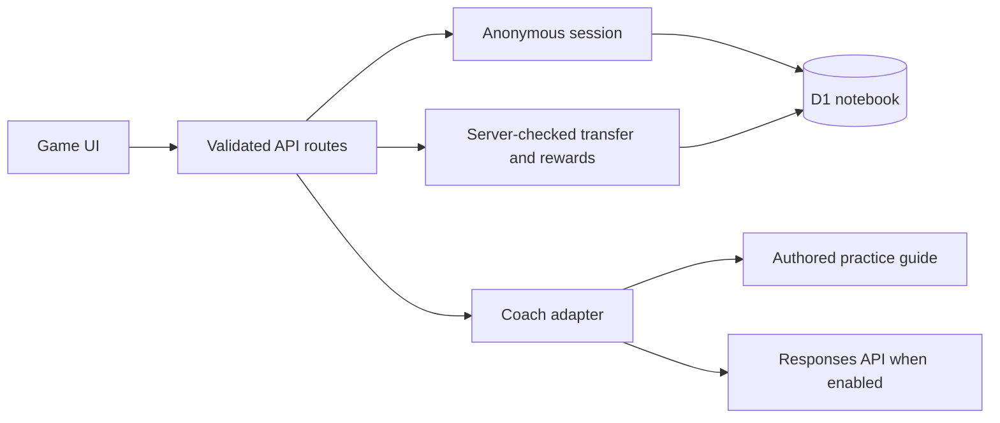

# Architecture

## Boundaries

The UI is React + TypeScript in the Next.js App Router shape, built by Vinext/Vite to a Cloudflare Worker. Existing shadcn/Radix primitives provide keyboard-aware tabs, buttons, textarea, progress, and reset confirmation. Lesson content is isolated from UI, transport, storage, and AI inference.

## Endpoints

| Endpoint               | Contract                                         | Behavior                                                                                       |
| ---------------------- | ------------------------------------------------ | ---------------------------------------------------------------------------------------------- |
| `GET /api/progress`    | No body                                          | Creates/reuses anonymous notebook and returns `{ progress, mode }`; no-store                   |
| `POST /api/teachback`  | `{ missionId, explanation, previousAttemptId? }` | Requires session; 20–1600 trimmed characters; returns `{ attemptId, feedback, revisions }`     |
| `POST /api/complete`   | `{ attemptId, answer }`                          | Requires matching session and ready attempt; checks authored transfer answer; saves best stars |
| `DELETE /api/progress` | No body                                          | Deletes notebook, attempt metadata, progress, and cookie                                       |
| `POST /api/coach`      | Retired                                          | 410; clients use the scoped teachback endpoint                                                 |

Feedback has `mode`, `notice`, `nextStep`, `question`, `concepts`, and `needsRevision`. AI-produced strings are rendered as plain React text, not HTML. UI keeps the explanation on transient failures. AI calls have a 20-second timeout and bounded output; errors fall back to authored feedback.

## Reward integrity

The server owns attempt identity, notebook ownership, lesson selection, revision count, answer checking, and rewards. A revision must reference an attempt in the same notebook and mission with a different explanation hash. Attempts older than 24 hours cannot be redeemed. Correct transfer answers upsert a unique `(learner_id, mission_id)` row using the maximum star count. Repeated submissions and lower-scoring replays do not increase total stars.

This is an effort system, not anti-cheat certification: copying text or superficial revisions can earn effort stars. A human-reviewed learning evaluation would be needed for stronger claims.

## Storage

`learners`: hash-derived session ID and creation timestamp.

`attempts`: ID, learner, mission, explanation hash, revisions, feedback mode, completion flag, timestamp. Index supports the learner/time rate guard.

`progress`: learner + mission primary key, best stars, first completion time.

Database operations use prepared statements and batched writes. Schema changes are generated by Drizzle and committed; production runs no create/alter SQL during requests. Local migration bookkeeping lives in ignored `.wrangler/state/teachback-migrations.json`; if you delete the database, remove that ledger as well (deleting `.wrangler/state` resets both).

## Deliberate limits

- Anonymous browser notebooks, no classroom identity or cross-device recovery.
- Six authored lessons, no arbitrary open-ended chatbot or generated curriculum.
- Text input and optional browser read-aloud, no microphone or audio storage.
- Per-notebook application rate guard is not a complete public-edge abuse control.
- No API key or paid provider call is required for local development or CI.
